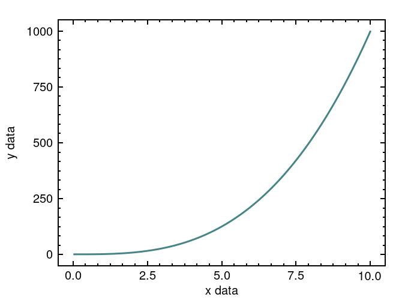

# plt

[](https://github.com/plt-rs/plt/actions/workflows/ci.yml)
[](https://crates.io/crates/plt)
[](https://docs.rs/plt)

A plotting library with a focus on publication level aesthetics and ergonomic control.

## Structure
- Plots are drawn on a `Subplot`.
- One or more subplots are organized in a `Layout`.
- The layout is added to a `Figure`, which is used to draw to a file or directly to a `Backend`.

## Use

To get started, see the [examples](https://github.com/plt-rs/plt/tree/main/plt/examples) directory in the main repository.

### Example
```rust
// create data
let xs: Vec<f64> = (0..=100).map(|n: u32| n as f64 * 0.1).collect();
let ys: Vec<f64> = xs.iter().map(|x| x.powi(3)).collect();

// create subplot
let mut sp = plt::Subplot::builder()
    .xlabel("x data")
    .ylabel("y data")
    .build();

// plot data
sp.plot(&xs, &ys).unwrap();

// make figure and add subplot
let mut fig = <plt::Figure>::default();
fig.set_layout(plt::SingleLayout::new(sp)).unwrap();

// save figure to file
fig.draw_file(plt::FileFormat::Png, "example.png").unwrap();
```



## Dependencies

The package currently depends on [Cairo](https://www.cairographics.org).

### Debian / Ubuntu
`apt install libcairo2-dev`

### Arch
`pacman -Syu cairo`
